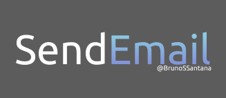
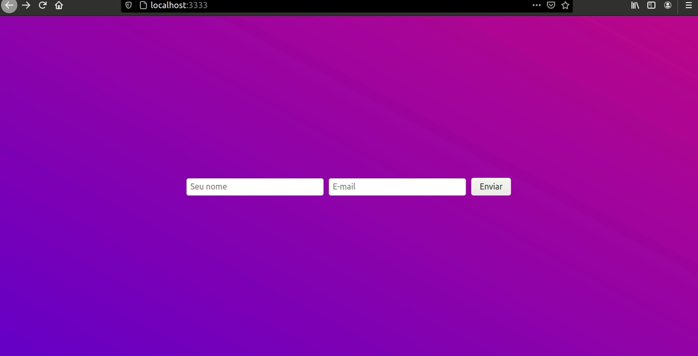
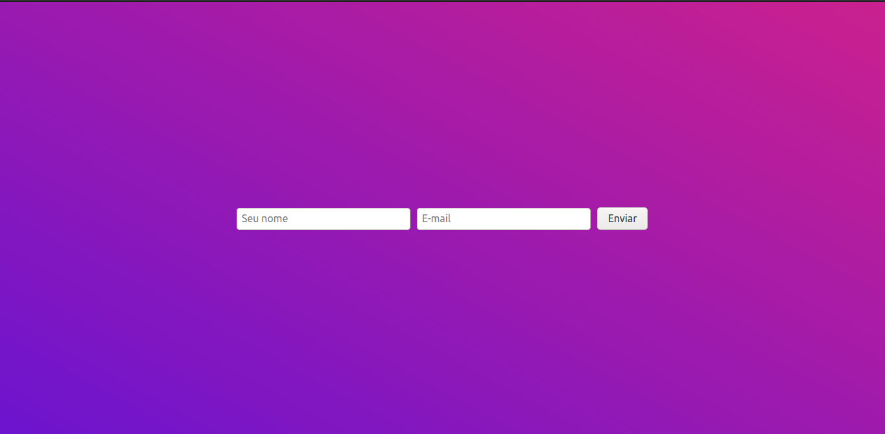
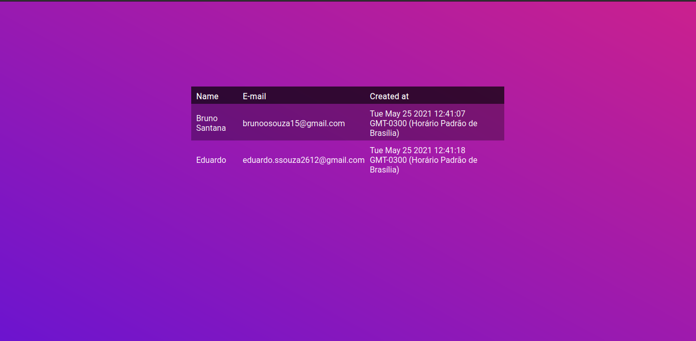

<p align="center">
   
</p>

<p align="center">
   
   
   
   
   
</p>

<p align="center">
 <a href="#overview">Overview</a> •
 <a href="#getting-started">Getting Started</a> •
 <a href="#routes">Routes</a> •
 <a href="#contribuition">Contribuition</a> •
 <a href="#author">Author</a> • 
 <a href="#license">License</a> • 
 <a href="#author">Author</a>
</p>

## Overview

> Nesta aplicação vamos receber dois valores, o nome e o email do usário , salvar em um banco de dados e enviar para o email cadastrado

<p align="center">

</p>


### Ajustes e melhorias

O projeto ainda está em desenvolvimento e as próximas atualizações serão voltadas nas seguintes tarefas:

- [x] Receber nome e e-mail
- [x] Salvar no banco de dados
- [x] Enviar e-mail
- [x] Listar e-mail's
- [ ] Enviar  um e-mail para todos os usuários
- [ ] Adicionar Classificações

## Getting Started

Este é um exemplo de como você pode dar instruções sobre como configurar seu projeto localmente. Para obter uma cópia local instalada e funcionando, siga estas etapas simples de exemplo.

### Prerequisites

Este é um exemplo de como listar as coisas de que você precisa para usar o software e como instalá-las.
- [x] [Nodejs](https://nodejs.org/en/)
- [x] [yarn](https://yarnpkg.com/)
- [x] [Mongodb](https://www.mongodb.com/)

### Installation

1. Clone the repo
   ```sh
   git clone https://github.com/your_username_/Project-Name.git
   ```
2. Install YARN packages
   ```sh
   yarn install
   ```

## Routes

**POST/**
http://localhost:3333/
> Aqui vamos receber o nome e o email do usuário



**GET**
http://localhost:3333/users
> Aqui será listada todos os usuários



## Contribuition

### Como contribuir?
Este é um projeto totalmente livre que aceita contribuições via pull requests no GitHub. Este documento tem a responsabilidade de alinhar as contribuições de acordo com os padrões estabelecidos no mesmo. Padrões recomendados por [gitmoji](https://gitmoji.dev/).

Para contribuir com SendEmail, siga estas etapas:

1. Faça um **fork** do projeto.
2. Crie uma nova branch com as suas alterações: `git checkout -b my-awesome-feature`
3. Salve as alterações e crie uma mensagem de commit contando o que você fez: `git commit -m "feature: My awesome feature"`
4. Envie as suas alterações: `git push origin my-awesome-feature`
   > Caso tenha alguma dúvida confira este [guia de como contribuir no GitHub](https://github.com/firstcontributions/first-contributions)

Como alternativa, consulte a documentação do GitHub em [como criar uma solicitação pull](https://help.github.com/en/github/collaborating-with-issues-and-pull-requests/creating-a-pull-request).

## Author
<a href="https://github.com/BrunoSSantana/">
 
 <br />
 <sub><b>Bruno Santana</b></sub></a> <a href="https://github.com/BrunoSSantana/" title="Rocketseat">🚀</a>

Feito com :purple_heart: por Bruno Santana 👋🏽


## Acknowledgements

* [Img Shields](https://shields.io)
* [README Template - iuricode](https://github.com/iuricode/README-template/)
* [Best README template - othneildrew](https://github.com/othneildrew/Best-README-Template/)


## License

Esse projeto está sob licença. Veja o arquivo [LICENÇA](LICENSE.md) para mais detalhes.

[⬆ Voltar ao topo](#nome-do-projeto)<br>
